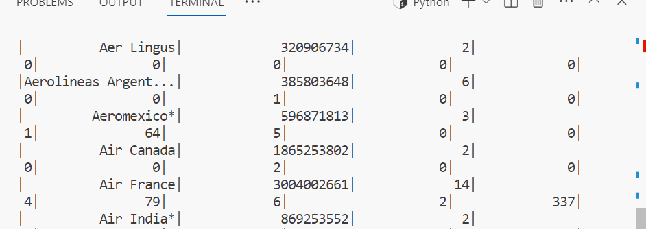

# MINI PROJECT 10 

In this project I have used the airlines_saftey database. I have used pyspark to run sql queries over the data.
The following is the result of and sql query used to display the airlines in the dataset which have had less that 20 incidents from 1985 to 1999. 
[

# STEPS 
Begin by opening Codespaces and waiting for the environment setup to complete.

Execute the Python script named "main.py."

Generate a Markdown file containing the output data and a summary of your PySpark analysis.

Format your code using the "make format" command.

Perform code linting with the "make lint" command to ensure code quality.

Run tests on your code using the "make test" command to check for correctness and functionality.

Proceed with data processing:

a. Start by extracting the dataset using the "extract" step.

b. Initialize a Spark session using the "start_spark" function.

c. Load the dataset into the Spark session with the "load_data" function.

d. Calculate and collect descriptive statistics on the dataset using the "describe" function.

e. Query and analyze the dataset with SQL or DataFrame operations using the "query" function.

f. Apply further data transformations to a sample dataset using the "example_transform" function.

Conclude the PySpark project by ending the Spark session using the "end_spark" function.
